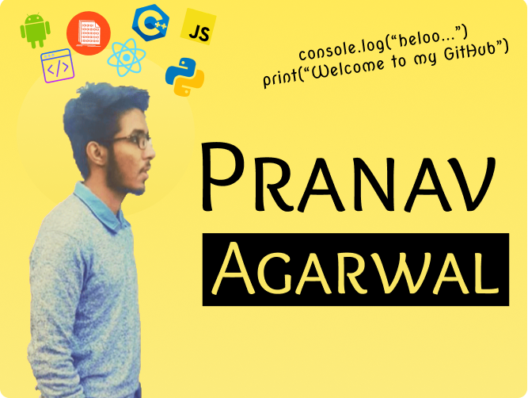

### Hey, there I'm Pranav - aka [pranav2012][website] 

 

 &nbsp;  &nbsp; 

## I'm Student, Developer, and a Cyber Security enthusiast!
- 🔭 I’m currently working on a [Project][website_Projects]!
- 🥅 2020 Goals: Contribute more to Open Source projects
- ⚡ Fun fact: I love to Sleep and play Games

 

 

|      Project :octocat:  |     Stars :star:   | Open PRs :bell:  | Forks :fire:  |
|-------------|-------------------|---|---|
| [**PythonFest**](https://github.com/pranav2012/Python-fest2020) |  |   |   |
| [**Linux Custom Scripts**](https://github.com/pranav2012/Linux-Custom-Scripts) |  |   |    |

### Languages and Tools:

[][webdevplaylist]
[][webdevplaylist]
[][webdevplaylist]
[][webdevplaylist]
[][webdevplaylist]
[][webdevplaylist]
[][webdevplaylist]
[][webdevplaylist]
[][webdevplaylist]
[][webdevplaylist]
[][webdevplaylist]
[][webdevplaylist]
[][webdevplaylist]
 
 

  

   
  

### Connect with me:

[][website]
[][youtube]
[][twitter]
[][linkedin]
[][instagram]

 <a href="#hugs-projects-by-pranav2012--">:top:</a> <strong>Show <a href="https://github.com/pranav2012?tab=repositories">some</a>&nbsp;:heart:&nbsp;by starring some of repositories!<strong>   

[website]: https://pranavportfolio.netlify.com/
[twitter]: https://twitter.com/pranava99
[youtube]: https://www.youtube.com/channel/UCNonLPXZE_Cl5rhKGYtH19Q
[instagram]: https://www.instagram.com/pranav.agr/
[linkedin]: https://www.linkedin.com/in/pranav-agarwal-579363166/
[website_projects]: https://portfolio-pranav2012.vercel.app/works
[webdevplaylist]: https://pranavportfolio.netlify.com/#about
